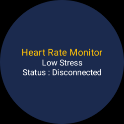
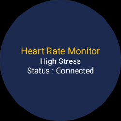

---
# Health Data Demo

## **Title and Introduction**:
   - **Name**: Health Data Demo
   - **Author**: Prakash Software Pvt Ltd
   - **Date**: 30 Jun 2025
   - **Purpose**: Display heart rate info into bpm after connect phone to wear.

## **Features**:
   - **HR History**: Users can see HR history if their HR goes 80 above.
   - **Setting**: Users can enable-disable HR alerts.
   - **Dashboard**: Users can see their HR into bpm live after connected to samsung wearable.

## **Tech Stack**:
   - **Android**: Built for Android devices (10.0+).
   - **Kotlin**: Written in Kotlin for smooth performance.
   - **Jetpack Compose**: Used for a modern, sleek UI.
   - **Dagger Hilt**: Manages app dependencies.
   - **Room**: Stores data locally.
   - **Ble**: Used to receive HR data from wear and transfer into phone.

## **Getting Started**:
### Prerequisites
- **Android Studio**: Latest version (e.g. Meerkat | 2024.3.1 Patch 2).
- **Kotlin**: Version 2.2.0 or higher.

### Steps
1. **Clone the Repository**:
   ```bash
   git clone <repository_url>
   cd HealthDataDemo
   ```

2. **Sync and Build**:
    - Open the project in Android Studio.
    - Sync the project with Gradle.
    - Build the project to ensure all dependencies are resolved.

3. **Run the App**:
    - Connect an Android device.
    - Run the app from Android Studio.

## **Screenshots**:
   
   
   